# 🌧 Sponge City Readiness Index (SCRI) for India

## IEEE GRSS Earth Day Hackathon 2026 — PS-5

A machine learning and geospatial analytics framework for assessing Sponge City Readiness across India using long-term rainfall observations, rainfall downscaling, explainable AI, and interactive visualization.

---

# 📌 Project Overview

Urban flooding and rainfall variability are increasing due to climate change and rapid urbanization.

This project develops a data-driven Sponge City Readiness Index (SCRI) that integrates:

- Long-term rainfall observations
- Geospatial indicators
- Machine Learning
- Explainable AI
- Interactive Dashboard

to identify vulnerable regions and support climate-resilient planning.

---

# 🖼 Project Architecture

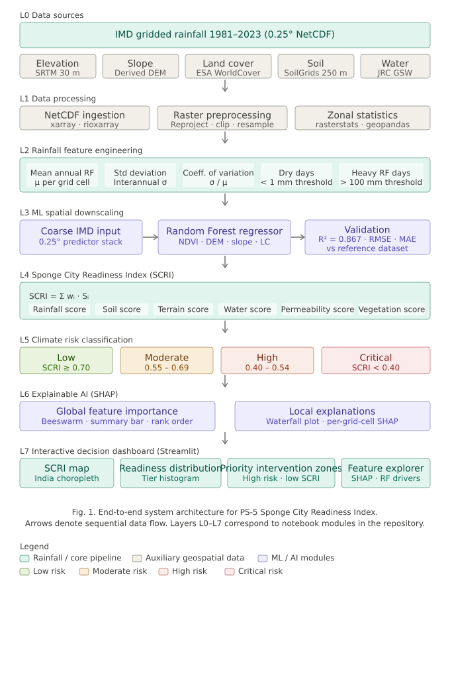

---

# 🎯 Objectives

- Develop a Sponge City Readiness Index (SCRI)
- Perform rainfall spatial downscaling using Machine Learning
- Identify climate-risk hotspots
- Improve interpretability using SHAP
- Provide decision-support through an interactive dashboard

---

# 🌍 Dataset

## Primary Dataset

### India Meteorological Department (IMD)

| Parameter | Value |
|------------|--------|
| Resolution | 0.25° × 0.25° |
| Coverage | Entire India |
| Period | 1981–2023 |
| Format | NetCDF |

### Auxiliary Datasets

- GEBCO Elevation
- SoilGrids Soil Clay Content
- SoilGrids Soil Organic Carbon
- JRC Global Surface Water

---

# ⚙️ Methodology

```text
IMD Rainfall Data
        ↓
Feature Engineering
        ↓
Random Forest Downscaling
        ↓
Environmental Feature Integration
        ↓
SCRI Computation
        ↓
Risk Classification
        ↓
SHAP Explainability
        ↓
Interactive Dashboard
```

---

# 🗺 SCRI Spatial Distribution

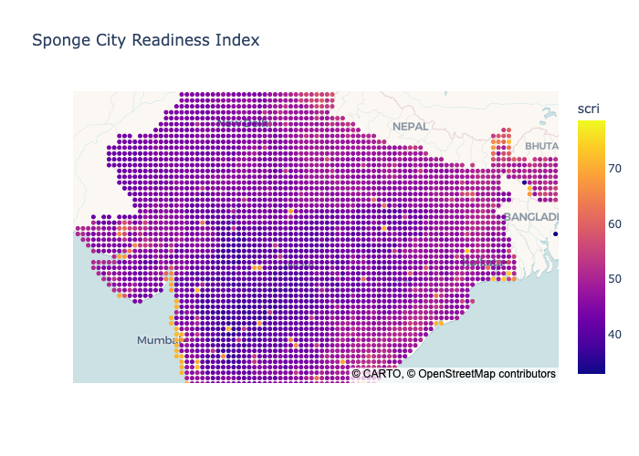

The generated SCRI map highlights geographical variability in rainfall resilience and identifies regions requiring priority interventions.

---

# 📊 SCRI Distribution Analysis

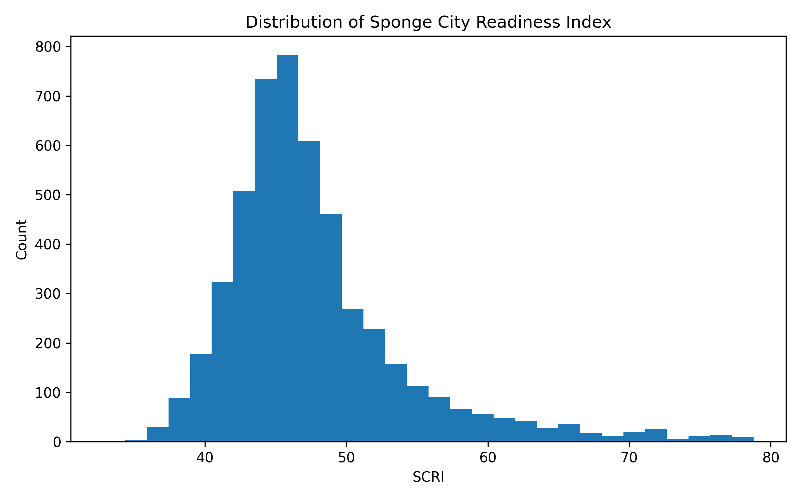

The distribution of readiness scores indicates substantial variation across Indian regions.

---

# 🚨 SCRI Risk Categories

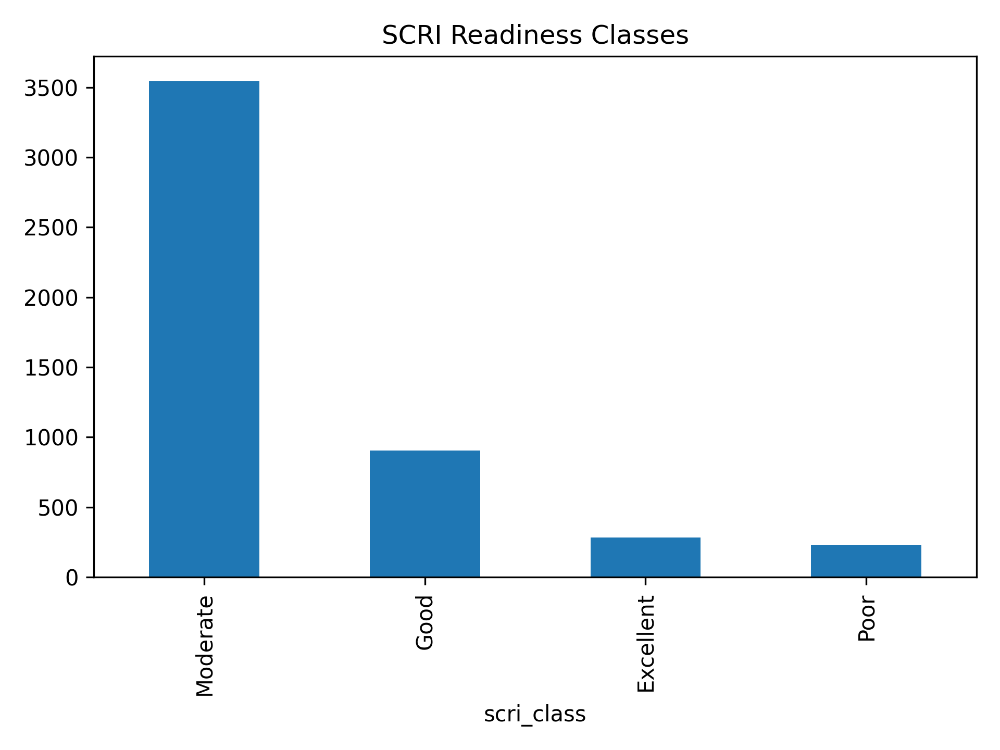

Regions are classified into:

- 🟢 Low Risk
- 🟡 Moderate Risk
- 🟠 High Risk
- 🔴 Critical Risk

---

# 🎯 Priority Intervention Zones

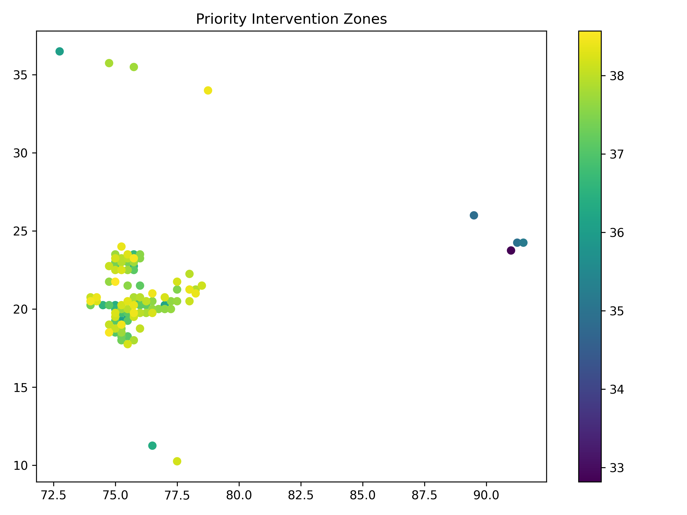

Low-readiness regions are highlighted for targeted climate adaptation and sponge-city planning.

---

# 🤖 Machine Learning

## Random Forest Classification

### Confusion Matrix

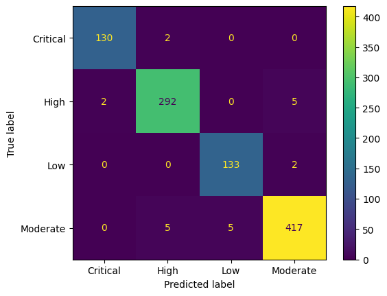

### Feature Importance

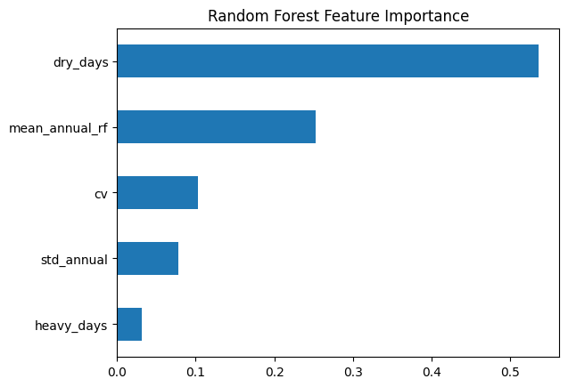

Dry-day frequency and rainfall variability emerge as dominant climate-risk drivers.

---

# 🌧 Rainfall Spatial Downscaling

## Feature Importance

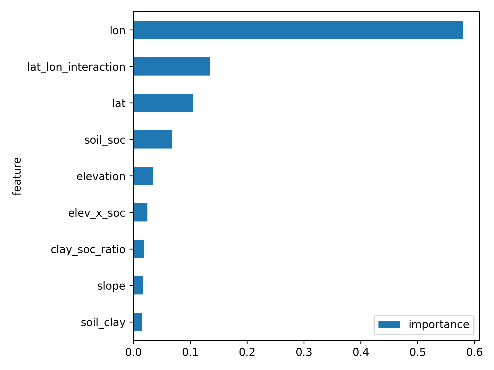

## Validation Results

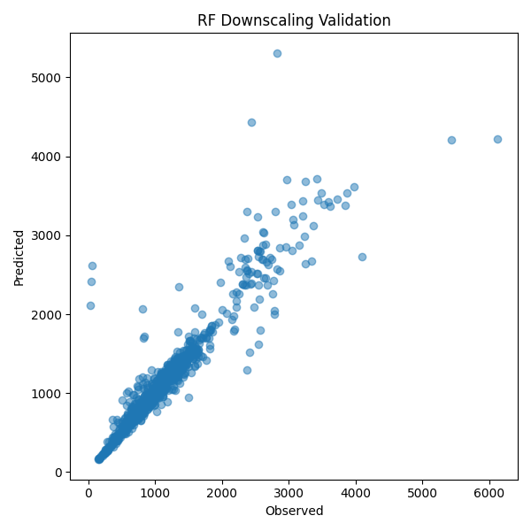

Performance:

- R² = 0.867
- Random Forest Regressor

The model successfully captures spatial rainfall variability and improves rainfall representation.

---

# 🔍 Explainable AI

## SHAP Analysis

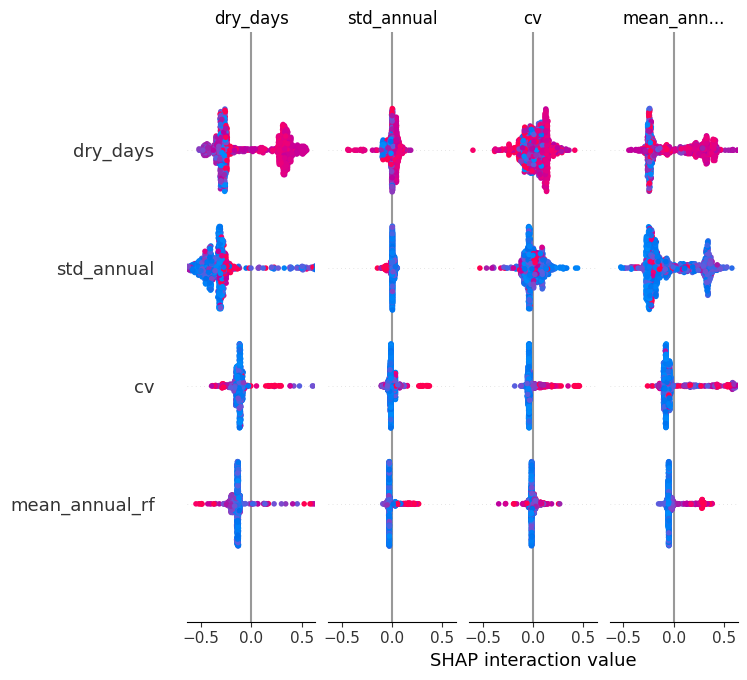

SHAP quantifies the contribution of individual indicators and improves transparency in climate-risk predictions.

---

# 📊 Interactive Dashboard

## Dashboard Overview

### SCRI Map

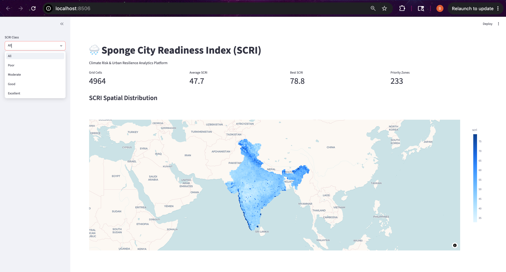

### Distribution Analytics


### Priority Zones & Feature Explorer


### Dataset Explorer


The dashboard enables interactive exploration of readiness patterns, hotspot identification, and geospatial analysis.

---

# 📂 Repository Structure

```text
.
├── notebooks/
│   ├── 01_rainfall_feature_engineering.ipynb
│   ├── 02_scri_development_and_risk_mapping.ipynb
│   ├── 03_climate_risk_modeling.ipynb
│   ├── 04_model_explainability_shap.ipynb
│   └── 05_interactive_decision_dashboard.ipynb
│
├── data/
├── figures/
├── dashboard/
├── report/
└── README.md
```

---

---

## Running the Interactive Dashboard

### 1. Clone the Repository

```bash
git clone https://github.com/BhumikaAggwl/sponge-city-readiness-india.git
cd sponge-city-readiness-india
```

### 2. Create Virtual Environment (Recommended)

```bash
python -m venv venv
source venv/bin/activate      # Linux / MacOS

# Windows
venv\Scripts\activate
```

### 3. Install Dependencies

```bash
pip install -r requirements.txt
```

### 4. Launch the Dashboard

```bash
streamlit run dashboard/app.py
```

The dashboard will automatically open in your browser at:

```text
http://localhost:8501
```

---

## Dashboard Features

The Streamlit dashboard provides:

- Interactive SCRI Spatial Distribution Map
- Sponge City Readiness Class Filtering
- SCRI Distribution Analysis
- Priority Intervention Zone Identification
- Feature-wise Data Exploration
- Dataset Inspection and Download
- Climate Risk Visualization

---

## Reproducing Results

The notebooks should be executed in the following order:

```text
01_rainfall_feature_engineering.ipynb
        ↓
02_scri_development_and_risk_mapping.ipynb
        ↓
03_climate_risk_modeling.ipynb
        ↓
04_model_explainability_shap.ipynb
        ↓
05_interactive_decision_dashboard.ipynb
```

This workflow reproduces all figures, machine learning models, SCRI calculations, risk maps, SHAP explanations, and dashboard outputs presented in the report.

---
# 🛠 Technology Stack

- Python
- Xarray
- Rasterio
- GeoPandas
- Scikit-Learn
- Random Forest
- SHAP
- Streamlit
- Plotly

---

# 🏆 Key Results

- National-scale Sponge City Readiness Assessment
- Machine Learning Rainfall Downscaling
- Climate Risk Hotspot Identification
- Explainable AI Analysis
- Interactive Decision-Support Platform

---

# 👩‍💻 Author

**Bhumika Aggarwal**

IEEE GRSS Earth Day Hackathon 2026
